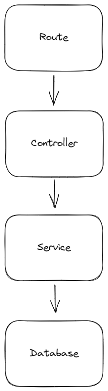

# Gate - Master - Multi Tenant Role Based Access Control (RBAC) Authentication API

The "Gate - Master " is a robust and versatile Multi-Tenant Role-Based Access Control (RBAC) Authentication API designed 
to provide secure access control and user management for multi-tenant applications. 
This powerful API serves as the gatekeeper, ensuring that only authorized users with the appropriate roles can access specific resources within an application

## Features
The "Gate - Master" API offers a wide range of features to meet the authentication and access control needs of multi-tenant applications:

### 1. Create an Application

Easily create and manage applications, allowing you to compartmentalize user access and permissions based on application boundaries.

### 2. Register a User for an Application

Effortlessly register users for specific applications, ensuring that they are only granted access to the relevant resources and features.

### 3. User Login

Enable users to securely log in to their respective applications with robust authentication mechanisms, safeguarding user credentials and data.

### 4. Create a Role

Define roles that represent various levels of access and responsibility within an application, tailoring them to suit your specific use case.

### 5. Assign a Role to a User

Associate roles with users, granting them access to designated functionalities while adhering to the principle of least privilege.

### 6. Check User Permissions with a Guard

Implement guard mechanisms to enforce role-based access control, allowing you to determine whether a user has the necessary permissions to perform specific actions or access particular resources within the application. This enhances security and ensures that users can only interact with what they are authorized to.

## What are technologies  used in this project?
* [Drizzle ORM](https://github.com/drizzle-team/drizzle-orm)
* [Fastify](https://www.fastify.io/)
* [PostgreSQL](https://www.postgresql.org/)
* [TypeScript](https://www.typescriptlang.org/)

## What you'll need
* Editor - [VS Code](https://code.visualstudio.com/download)
* Node.js - [Download](https://nodejs.org/en/download/)
* A database - [PostgreSQL by Neon](https://bit.ly/tomdoestech)
* A REST client - [Thunder Client](https://marketplace.visualstudio.com/items?itemName=rangav.vscode-thunder-client)

## What i  learn from this project 
By exploring this project, what i gained knowledge in the following areas:

* Building multi-tenant applications
* Implementing Role-Based Access Control (RBAC) systems
* Understanding basic relational database concepts
* Organizing backend services with a structured file system
* Utilizing TypeScript for type-safe development
* Leveraging the Fastify framework for building efficient APIs
* Designing RESTful API endpoints
* Using Drizzle ORM for database interactions

## Data structure

## Data flow

## The steps i followed while developing the project
1. Setup the initial application
2. Create a database with Neon
3. Create database schemas
4. Run migrations
5. Register an application
6. Register a user
7. Login
8. Create a role
9. Assign a role to a user
10. Check user permissions with a guard

## Helpful files
* CMD - Commands used in the project
* api.json - Thunder Client collection

## Tips
* Infer the applicationId from the JWT where possible
* Include the applicationId in queries
